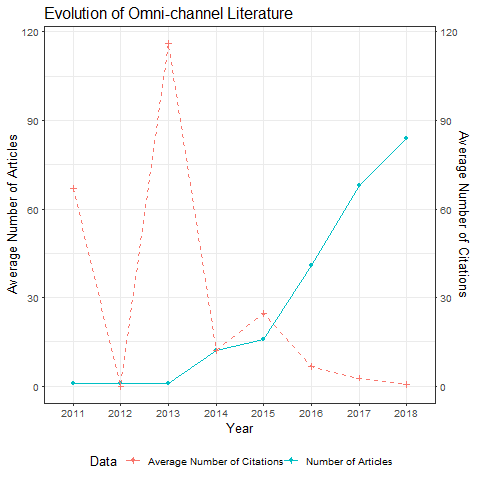
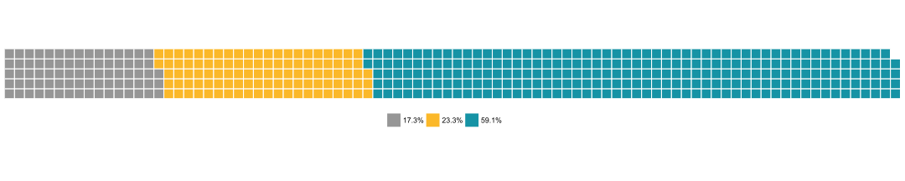
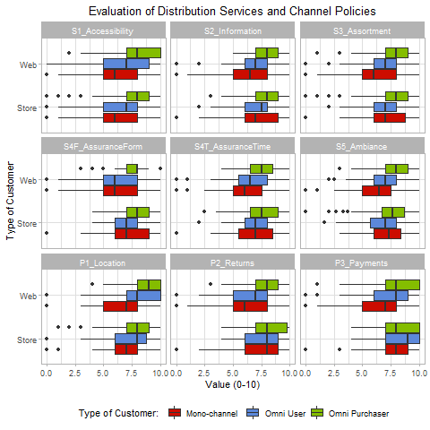
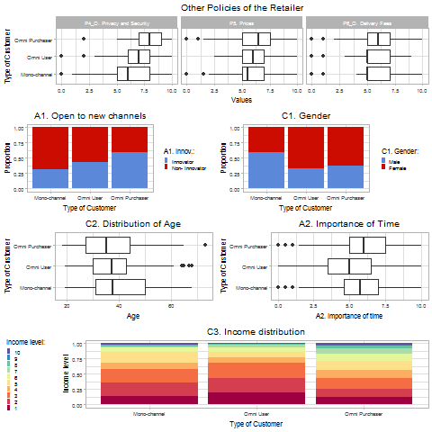
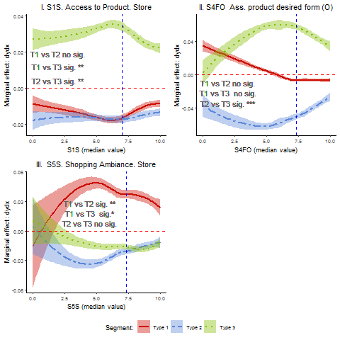
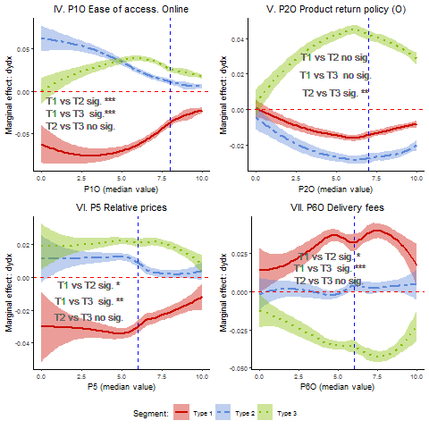
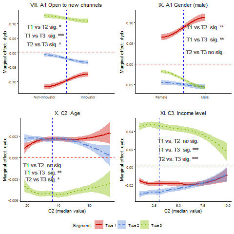

```{r, include = FALSE, eval = knitr::opts_knit$get("rmarkdown.pandoc.to") == "html"}
# Enables Font Awesome in HTML based bookdown outputs.
fa <- rmarkdown::html_dependency_font_awesome()
htmltools::tagList(fa)
```

class: inverso, middle, center

# 1. Motivation


---
class: middle, left

## Full development of online channels

<hr>

.pull-left[
- Nearly full penetration of online channels in <b><span class="rojito">companies</span></b>

- <b><span class="rojito">Consumers</span></b> use a variety of tools in order to access these channels any time in any place
]

.pull-right[

]


---
class: middle, center

## In this context: Omni-channel Research Top Priority

<hr>

```{r echo=FALSE, message=FALSE, warning=FALSE, out.width="60%"}


```

<p></p>

*<small>[Image Credit: Marketing Science Institute (2018), “Research Priorities 2018-2020”<br> Cambridge, Mass.](https://www.msi.org/research/2018-2020-research-priorities/)</small>*
---
class: center, middle

### Outburst in the use of the term <b>"OMNICHANNEL"</b>: <b><span class="rojito">ISI search results</span></b>

```{r echo=FALSE, message=FALSE, warning=FALSE, out.width="50%"}



```

---

class: left, middle

## But, what exactly does "omnichannel" mean?

###  Omni-channel <span class="rojito">management</span>  

<blockquote>- The synergetic management of the numerous available channels and customer touchpoints, in such a way that the customer experience across channels and the performance over channels is optimized</blockquote>

<a href="https://www.sciencedirect.com/science/article/pii/S0022435915000214" target="_blank"><p align="right" >- Verhoef, Kannan, Inman, 2015</p></a>
---

class: left, middle

## What does omnichannel <span class="rojito">behavior</span> mean? ([Ailawadi and Farris, 2017](https://linkinghub.elsevier.com/retrieve/pii/S0022435916300823)):

.pull-left[### "Channel mix approach": 

<blockquote>Combination and choices between channels of the same provider</blockquote>


e.g. [Pauwels et al, 2011](https://linkinghub.elsevier.com/retrieve/pii/S0022435910000771), [Herhausen et al 2015](https://www.sciencedirect.com/science/article/pii/S0022435914000979?via%3Dihub), [Fornari et al 2016](https://doi.org/10.1108/IJRDM-07-2015-0103), [Kim and Chun, 2018](https://www.sciencedirect.com/science/article/pii/S0167923618300174?via%3Dihub)
]

.pull-right[
### "Customer journey approach"

<blockquote>Different stages in the same purchase proccess (possibly different providers)</blockquote>

e.g. [Rapp et al, 2015](https://www.sciencedirect.com/science/article/pii/S0022435914000955?via%3Dihub), [Gensler, Neslin and Verhoef, 2017](https://www.sciencedirect.com/science/article/pii/S1094996817300142?via%3Dihub), [Kang, 2018](https://www.tandfonline.com/doi/full/10.1080/15332861.2018.1433907), [Park and Kim, 2018](https://www.sciencedirect.com/science/article/pii/S0969698918300778?via%3Dihub)
]
---
class: left, middle

## One retailer and its customer base: <u>Unsolved questions</u>

.pull-left[

- All customers are equally "omnichannel"?, how to distinguish one purchase proccess from another?

-  <span class="rojito">O1. Can we provide unambigous rules for the classification?</span>
]

.pull-right[

- How do they use company's channels and services? Are there any differences between customers according to their omnichannel behavior? 

- <span class="rojito">O2. Can we provide a sensible segmentation?</span>

]

---

class: inverso, middle, center

# 2. Conceptual framework


---
class: left, middle

## Focus: One company studying its customers (manufacturer or retailer) with two channels

- Dyadic perspective customer-firm 

- Two channels: brick and mortar and online

e.g. [Brynjolfsson and Hu, 2011](https://pubsonline.informs.org/doi/abs/10.1287/mnsc.1110.1371), [Chopra, 2016](https://link.springer.com/article/10.1007%2Fs40622-015-0118-9), [Bell, Gallino and Moreno, 2018](https://doi.org/10.1287/mnsc.2016.2684)...

---

class: left, middle

## Distribution services 

- Core concept for the understanding of the omni-channel behavior
- The provision of <span class="rojito">distribution services</span> (DS) is the core function of distribution channels: 

Categorization:

- <i class="rojito fa fa-map-marker"></i> accessibility to the product
- <i class="rojito fa fa-info-circle"></i> information
- <i class="rojito fa fa-th-list"></i> breadth and depth of assortment
- <i class="rojito fa fa-shield"></i> assurance of product delivery in time and form 
- <i class="rojito fa fa-smile-o "></i> ambiance 

([Kopalle and Lehman, 2006](https://pubsonline.informs.org/doi/10.1287/mksc.1050.0122), [Betancourt et al 2007](https://doi.org/10.1007/s11129-007-9027-3))


---
class: middle

## Channel mix and Distribution Services (I)


.pull-left[
- The combination of both channels allows the company to attend <span class="rojito">different demands of DS</span> for different customers or different situations

- Both channels offer different combinations of distribution services more suitable for some customers and/or situations

- "Channel-mix perspective"
]

.pull-right[

]
---
class: middle

## Channel mix and Distribution Services (II)

.pull-left[
- IT have brought a <span class="rojito">BIG</span> change: the <span class="rojito">separability</span> of DS in time and space ([Betancourt et al 2016](https://linkinghub.elsevier.com/retrieve/pii/S1094996815000456))

- Separability makes it possible for customers to <span class="rojito">combine DS</span> from different company's channels<br>

- The combination of both channels allows the company to attend <span class="rojito">demands of combinations of DS</span> for some (or all) customers

- "Customer journey" perspective
 
]

.pull-right[


]
---
class: middle
### Examples

 <table border="1" class="tablabase">
                <thead><th width="60%">Examples</th><th width="20%">Store</th><th width="20%">Web</th></thead>
                <tr>
                    <td>A customer <span class="rojito">purchases at the company’s retail store</span> after getting <span class="rojito">information about the products</span> in the company’s web site</td>
                    <td><i class="turquesa fa fa-map-marker"></i>
                        <i class="turquesa fa fa-info-circle"></i>
                        <i class="turquesa fa fa-th-list"></i>
                        <i class="turquesa fa fa-shield"></i>
                        <i class="turquesa fa fa-smile-o "></i></td>
                    <td>
                        <i class="turquesa fa fa-info-circle"></i>
                        <i class="turquesa fa fa-smile-o "></i>
                    </td>
                </tr>
                <tr>
                    <td>A customer <span class="rojito">purchases products at the company’s web site</span> and asks the product to be <span class="rojito">delivered to one retail store</span> located close to her/his office</td>
                    <td><i class="turquesa fa fa-map-marker"></i>
                        <i class="turquesa fa fa-smile-o "></i></td>
                    <td><i class="turquesa fa fa-map-marker"></i>
                        <i class="turquesa fa fa-info-circle"></i>
                        <i class="turquesa fa fa-th-list"></i>
                        <i class="turquesa fa fa-shield"></i>
                        <i class="turquesa fa fa-smile-o "></i></td>
                </tr>
                <tr>
                    <td>A customer never purchases products online and never visits the company’s website</td>
                    <td><i class="turquesa fa fa-map-marker"></i>
                        <i class="turquesa fa fa-info-circle"></i>
                        <i class="turquesa fa fa-th-list"></i>
                        <i class="turquesa fa fa-shield"></i>
                        <i class="turquesa fa fa-smile-o "></i></td>
                    <td><i class="turquesa fa fa-minus "></i></td>
                </tr>
                                <tr>
                    <td>...</td>
                    <td><i class="turquesa fa fa-ellipsis-h"></i></td>
                    <td><i class="turquesa fa fa-ellipsis-h"></i></td>
                </tr>
            </table>


---
class: middle

### In this setting, we define:

- A <span class="rojito">customer</span>: Someone that has bought from one of the company's channel during a given period of analysis.

- A <span class="rojito">user</span>: A company’s customer that interacts with the company (use the DS provided by the company) through one channel during the period of analysis.

---
class: middle

### We distinguish three types of customers in a certain period of time:

<hr>
<table class="tablabase">
<thead><th width="33%">Purchase Channel</th><th width="33%">Service Channel</th><th width="33%">Type</th></thead>
<tr><td><i class="rojito fa fa-circle"></i> <i class="rojito fa fa-circle-o"></i> Monochannel Customer</td><td><i class="rojito fa fa-circle"></i> <i class="rojito fa fa-circle-o"></i>  Monochannel User</td><td>Type I: Monochannel customer</td></tr>
                <tr><td><i class="rojito fa fa-circle"></i> <i class="rojito fa fa-circle-o"></i>  Monochannel Customer</td><td><i class="rojito fa fa-circle"></i> <i class="rojito fa fa-circle"></i>  Multichannel User</td><td>Type II: Omnichannel User</td></tr>
                <tr><td><i class="rojito fa fa-circle"></i> <i class="rojito fa fa-circle"></i>  Multichannel Customer</td><td><i class="rojito fa fa-circle"></i> <i class="rojito fa fa-circle"></i> Multichannel User</td><td> Type III: Omnichannel Purchaser</td></tr>
            </table>

---

class: inverso, middle, center

# 3. Empirical Application

---

class: middle

## Objectives

.pull-left[

- O1. Identification of the <span class="rojito">segments</span> in the multichannel operation of a company with two channels (web and store)
]
.pull-right[
- O2. Explanation of how customers self-select into these <span class="rojito">three segments</span> according to evaluation of DS, channel policies and personal characteristics]

---
class: middle


## Empirical setting

- <span style="font-size:0.9em" class="rojito">Population Definition</span>: Customers of a well-known global fast fashion retailer company</p>
- <span style="font-size:0.9em" class="rojito">Online Panel Survey</span>: 450 valid responses from firms' customers in the <u>last six months</u></p>
- <span style="font-size:0.9em" class="rojito">Measures</span>: 
  - (1) Shopping behavior
  - (2) Evaluation of DS at the store and at the web
  - (3) Channel policies
  - (4) General attitudes
  - (5) Consumer characteristics

---
class: middle

### Segmentation based on behavior (visits and purchases) in the last year: Results

<hr>
<table class="tablabase">
                <thead><th width="18%">Purchase Channel</th><th width="18%">Services</th><th width="30%" >Type</th><th width="18%">Number</th><th width="8%"><i class="fa fa-home"></i></th><th width="8%"><i class="fa fa-laptop"></i></th></thead>
                <tr><td><i class="rojito fa fa-circle"></i> <i class="rojito fa fa-circle-o"></i></td><td><i class="rojito fa fa-circle"></i> <i class="rojito fa fa-circle-o"></i></td><td style="color:white; background-color:#969696 ">Type I: Monochannel Customers</td><td>78<td>63</td><td>15</td></tr>
                 <tr><td><i class="rojito fa fa-circle"></i> <i class="rojito fa fa-circle-o"></i> </td><td><i class="rojito fa fa-circle"></i> <i class="rojito fa fa-circle"></i></td><td style="color:white; background-color:#FBB829"> Type II: Omni-Channel Users</td><td>106</td><td>87</td><td>19</td></tr>
                <tr><td><i class="rojito fa fa-circle"></i> <i class="rojito fa fa-circle"></i></td><td><i class="rojito fa fa-circle"></i> <i class="rojito fa fa-circle"></i></td><td  style="color:white; background-color:#1693a5"> Type III: Omni-Channel Purchasers </td><td>266</td><td colspan="2"></td></tr>
            </table>
                
---

<table class="tablabase peque10" style="margin-left: auto; margin-right: auto; font-size:0.6">
 <thead>
  <tr>
   <th style="text-align:left;"> shortname </th>
   <th style="text-align:left;"> fullname </th>
   <th style="text-align:right;"> N </th>
   <th style="text-align:right;"> Min </th>
   <th style="text-align:right;"> Max </th>
   <th style="text-align:right;"> Mean </th>
   <th style="text-align:right;"> SD </th>
  </tr>
 </thead>
<tbody>
  <tr>
   <td style="text-align:left;"> S1_S </td>
   <td style="text-align:left;"> Convenience of location access point (S)</td>
   <td style="text-align:right;"> 450 </td>
   <td style="text-align:right;"> 0 </td>
   <td style="text-align:right;"> 10.0 </td>
   <td style="text-align:right;"> 6.99 </td>
   <td style="text-align:right;"> 2.29 </td>
  </tr>
  <tr>
   <td style="text-align:left;"> S1_W </td>
   <td style="text-align:left;"> Convenience of location access point (W)</td>
   <td style="text-align:right;"> 450 </td>
   <td style="text-align:right;"> 0 </td>
   <td style="text-align:right;"> 10.0 </td>
   <td style="text-align:right;"> 7.50 </td>
   <td style="text-align:right;"> 2.15 </td>
  </tr>
  <tr>
   <td style="text-align:left;"> S2_S </td>
   <td style="text-align:left;"> Amount of product information (S) </td>
   <td style="text-align:right;"> 450 </td>
   <td style="text-align:right;"> 0 </td>
   <td style="text-align:right;"> 10.0 </td>
   <td style="text-align:right;"> 7.62 </td>
   <td style="text-align:right;"> 1.72 </td>
  </tr>
  <tr>
   <td style="text-align:left;"> S2_W </td>
   <td style="text-align:left;"> Amount of product information (W) </td>
   <td style="text-align:right;"> 450 </td>
   <td style="text-align:right;"> 0 </td>
   <td style="text-align:right;"> 10.0 </td>
   <td style="text-align:right;"> 7.39 </td>
   <td style="text-align:right;"> 1.82 </td>
  </tr>
  <tr>
   <td style="text-align:left;"> S3_S </td>
   <td style="text-align:left;"> Available assortment at time of purchase (S) </td>
   <td style="text-align:right;"> 450 </td>
   <td style="text-align:right;"> 0 </td>
   <td style="text-align:right;"> 10.0 </td>
   <td style="text-align:right;"> 7.41 </td>
   <td style="text-align:right;"> 1.74 </td>
  </tr>
  <tr>
   <td style="text-align:left;"> S3_W </td>
   <td style="text-align:left;"> Available assortment at time of purchase (W) </td>
   <td style="text-align:right;"> 450 </td>
   <td style="text-align:right;"> 0 </td>
   <td style="text-align:right;"> 10.0 </td>
   <td style="text-align:right;"> 7.23 </td>
   <td style="text-align:right;"> 1.96 </td>
  </tr>
  <tr>
   <td style="text-align:left;"> S4F_S </td>
   <td style="text-align:left;"> Assurance of product delivery in the desired form  (S) </td>
   <td style="text-align:right;"> 450 </td>
   <td style="text-align:right;"> 0 </td>
   <td style="text-align:right;"> 10.0 </td>
   <td style="text-align:right;"> 7.60 </td>
   <td style="text-align:right;"> 1.58 </td>
  </tr>
  <tr>
   <td style="text-align:left;"> S4F_W </td>
   <td style="text-align:left;"> Assurance of product delivery in the desired form (W) </td>
   <td style="text-align:right;"> 450 </td>
   <td style="text-align:right;"> 0 </td>
   <td style="text-align:right;"> 10.0 </td>
   <td style="text-align:right;"> 7.02 </td>
   <td style="text-align:right;"> 1.93 </td>
  </tr>
  <tr>
   <td style="text-align:left;"> S4T_S </td>
   <td style="text-align:left;"> Assurance of timely product delivery (S) </td>
   <td style="text-align:right;"> 450 </td>
   <td style="text-align:right;"> 0 </td>
   <td style="text-align:right;"> 10.0 </td>
   <td style="text-align:right;"> 7.38 </td>
   <td style="text-align:right;"> 1.57 </td>
  </tr>
  <tr>
   <td style="text-align:left;"> S4T_W </td>
   <td style="text-align:left;"> Assurance of timely product delivery (W) </td>
   <td style="text-align:right;"> 450 </td>
   <td style="text-align:right;"> 0 </td>
   <td style="text-align:right;"> 10.0 </td>
   <td style="text-align:right;"> 7.02 </td>
   <td style="text-align:right;"> 1.84 </td>
  </tr>
  <tr>
   <td style="text-align:left;"> S5_S </td>
   <td style="text-align:left;"> Shopping ambiance (S) </td>
   <td style="text-align:right;"> 450 </td>
   <td style="text-align:right;"> 0 </td>
   <td style="text-align:right;"> 10.0 </td>
   <td style="text-align:right;"> 7.38 </td>
   <td style="text-align:right;"> 1.65 </td>
  </tr>
  <tr>
   <td style="text-align:left;"> S5_W </td>
   <td style="text-align:left;"> Shopping ambiance (W) </td>
   <td style="text-align:right;"> 450 </td>
   <td style="text-align:right;"> 0 </td>
   <td style="text-align:right;"> 10.0 </td>
   <td style="text-align:right;"> 7.37 </td>
   <td style="text-align:right;"> 1.76 </td>
  </tr>
  <tr>
   <td style="text-align:left;"> P1_S </td>
   <td style="text-align:left;"> Ease of access according to location (S)</td>
   <td style="text-align:right;"> 450 </td>
   <td style="text-align:right;"> 0 </td>
   <td style="text-align:right;"> 10.0 </td>
   <td style="text-align:right;"> 7.58 </td>
   <td style="text-align:right;"> 1.88 </td>
  </tr>
  <tr>
   <td style="text-align:left;"> P1_W </td>
   <td style="text-align:left;"> Ease of access to the webpage (W)</td>
   <td style="text-align:right;"> 450 </td>
   <td style="text-align:right;"> 0 </td>
   <td style="text-align:right;"> 10.0 </td>
   <td style="text-align:right;"> 8.12 </td>
   <td style="text-align:right;"> 1.91 </td>
  </tr>
  <tr>
   <td style="text-align:left;"> P2_S </td>
   <td style="text-align:left;"> Compliance with product return policy (S) </td>
   <td style="text-align:right;"> 450 </td>
   <td style="text-align:right;"> 0 </td>
   <td style="text-align:right;"> 10.0 </td>
   <td style="text-align:right;"> 7.78 </td>
   <td style="text-align:right;"> 1.75 </td>
  </tr>
  <tr>
   <td style="text-align:left;"> P2_W </td>
   <td style="text-align:left;"> Compliance with product return policy (W) </td>
   <td style="text-align:right;"> 450 </td>
   <td style="text-align:right;"> 0 </td>
   <td style="text-align:right;"> 10.0 </td>
   <td style="text-align:right;"> 7.19 </td>
   <td style="text-align:right;"> 2.18 </td>
  </tr>
  <tr>
   <td style="text-align:left;"> P3_S </td>
   <td style="text-align:left;"> Compliance with accepted modes of payment (S) </td>
   <td style="text-align:right;"> 450 </td>
   <td style="text-align:right;"> 0 </td>
   <td style="text-align:right;"> 10.0 </td>
   <td style="text-align:right;"> 8.16 </td>
   <td style="text-align:right;"> 1.66 </td>
  </tr>
  <tr>
   <td style="text-align:left;"> P3_W </td>
   <td style="text-align:left;"> Compliance with accepted modes of payment (W) </td>
   <td style="text-align:right;"> 450 </td>
   <td style="text-align:right;"> 0 </td>
   <td style="text-align:right;"> 10.0 </td>
   <td style="text-align:right;"> 7.64 </td>
   <td style="text-align:right;"> 2.11 </td>
  </tr>
  <tr>
   <td style="text-align:left;"> P4_W </td>
   <td style="text-align:left;"> Confidence in online privacy and security policy (W) </td>
   <td style="text-align:right;"> 450 </td>
   <td style="text-align:right;"> 0 </td>
   <td style="text-align:right;"> 10.0 </td>
   <td style="text-align:right;"> 7.38 </td>
   <td style="text-align:right;"> 1.93 </td>
  </tr>
  <tr>
   <td style="text-align:left;"> P5 </td>
   <td style="text-align:left;"> Price differential with respect to similar brands </td>
   <td style="text-align:right;"> 450 </td>
   <td style="text-align:right;"> 0 </td>
   <td style="text-align:right;"> 10.0 </td>
   <td style="text-align:right;"> 6.21 </td>
   <td style="text-align:right;"> 1.74 </td>
  </tr>
  <tr>
   <td style="text-align:left;"> P6_W </td>
   <td style="text-align:left;"> Transport cost differential with respect to similar brands </td>
   <td style="text-align:right;"> 450 </td>
   <td style="text-align:right;"> 0 </td>
   <td style="text-align:right;"> 10.0 </td>
   <td style="text-align:right;"> 5.76 </td>
   <td style="text-align:right;"> 1.84 </td>
  </tr>
  <tr>
   <td style="text-align:left;"> A1 </td>
   <td style="text-align:left;"> Innovativeness (0;1) </td>
   <td style="text-align:right;"> 450 </td>
   <td style="text-align:right;"> 0 </td>
   <td style="text-align:right;"> 1.0 </td>
   <td style="text-align:right;"> 0.39 </td>
   <td style="text-align:right;"> 0.49 </td>
  </tr>
  <tr>
   <td style="text-align:left;"> A2 </td>
   <td style="text-align:left;"> Importance reducing purchasing time </td>
   <td style="text-align:right;"> 450 </td>
   <td style="text-align:right;"> 0 </td>
   <td style="text-align:right;"> 10.0 </td>
   <td style="text-align:right;"> 5.60 </td>
   <td style="text-align:right;"> 2.40 </td>
  </tr>
  <tr>
   <td style="text-align:left;"> C1 </td>
   <td style="text-align:left;"> Gender (Male) (0;1) </td>
   <td style="text-align:right;"> 450 </td>
   <td style="text-align:right;"> 0 </td>
   <td style="text-align:right;"> 1.0 </td>
   <td style="text-align:right;"> 0.40 </td>
   <td style="text-align:right;"> 0.49 </td>
  </tr>
  <tr>
   <td style="text-align:left;"> C2 </td>
   <td style="text-align:left;"> Age </td>
   <td style="text-align:right;"> 450 </td>
   <td style="text-align:right;"> 18 </td>
   <td style="text-align:right;"> 73.0 </td>
   <td style="text-align:right;"> 37.00 </td>
   <td style="text-align:right;"> 11.39 </td>
  </tr>
  <tr>
   <td style="text-align:left;"> C3 </td>
   <td style="text-align:left;"> Income (1 to 10) </td>
   <td style="text-align:right;"> 450 </td>
   <td style="text-align:right;"> 1 </td>
   <td style="text-align:right;"> 10.0 </td>
   <td style="text-align:right;"> 3.86 </td>
   <td style="text-align:right;"> 2.19 </td>
  </tr>
  <tr>
   <td style="text-align:left;"> C4 </td>
   <td style="text-align:left;"> Distance to the store (minutes) </td>
   <td style="text-align:right;"> 450 </td>
   <td style="text-align:right;"> 2 </td>
   <td style="text-align:right;"> 206.0 </td>
   <td style="text-align:right;"> 19.91 </td>
   <td style="text-align:right;"> 18.96 </td>
  </tr>
  <tr>
   <td style="text-align:left;"> L1 </td>
   <td style="text-align:left;"> Percentage of purchases </td>
   <td style="text-align:right;"> 450 </td>
   <td style="text-align:right;"> 0 </td>
   <td style="text-align:right;"> 9.5 </td>
   <td style="text-align:right;"> 3.63 </td>
   <td style="text-align:right;"> 2.23 </td>
  </tr>
  <tr>
   <td style="text-align:left;"> L2 </td>
   <td style="text-align:left;"> Share Store </td>
   <td style="text-align:right;"> 450 </td>
   <td style="text-align:right;"> 0 </td>
   <td style="text-align:right;"> 10.0 </td>
   <td style="text-align:right;"> 6.09 </td>
   <td style="text-align:right;"> 2.61 </td>
  </tr>
  <tr>
   <td style="text-align:left;"> L3 </td>
   <td style="text-align:left;"> Share online </td>
   <td style="text-align:right;"> 450 </td>
   <td style="text-align:right;"> 0 </td>
   <td style="text-align:right;"> 10.0 </td>
   <td style="text-align:right;"> 4.81 </td>
   <td style="text-align:right;"> 3.11 </td>
  </tr>
</tbody>
</table>

---
class: center

### Differences between segments (I)


<hr>

```{r echo=FALSE, message=FALSE, warning=FALSE, out.width="50%"}



```

---

class: center

### Differences between segments (II)


<hr>

```{r echo=FALSE, message=FALSE, warning=FALSE, out.width="50%"}



```

---


class: middle

### Segmentation Analysis: Multinomial Logit Model
   
$U_i=x_i\beta+u_i$

where $i=1,2,3$ <br> $1 = Type I$, $2 = Type II$, $3 = Type III$

$x_i$: variables used to describe the services offered by both channels, channel policies and consumer attitudes and demographics

$u_i$ is the error term.

---

class: middle


<table class="tablabase peque10" style="font-size: 0.35em"><caption><strong>Multinomial Logit Model- Reference level Mono-channel customers</strong></caption>
<tr><td colspan="3" style="border-bottom: 1px solid black"></td></tr><tr><td style="text-align:left"></td><td colspan="2"><em>Dependent variable:</em></td></tr>
<tr><td></td><td colspan="2" style="border-bottom: 1px solid black"></td></tr>
<tr><td style="text-align:left"></td><td>Type 2</td><td>Type 3</td></tr>
<tr><td colspan="3" style="border-bottom: 1px solid black"></td></tr><tr><td style="text-align:left">S1S Convenience of location access point (S)</td><td>0.034 (0.092)</td><td>0.202<sup>**</sup> (0.095)</td></tr>
<tr><td style="text-align:left">S1O Convenience of location access point (O)</td><td>-0.147 (0.124)</td><td>-0.107 (0.127)</td></tr>
<tr><td style="text-align:left">S2S Product information (S)</td><td>-0.059 (0.164)</td><td>-0.180 (0.160)</td></tr>
<tr><td style="text-align:left">S2O Product information (O)</td><td>-0.040 (0.177)</td><td>-0.171 (0.177)</td></tr>
<tr><td style="text-align:left">S3S Assortment time of purchase (S)</td><td>-0.107 (0.153)</td><td>-0.159 (0.155)</td></tr>
<tr><td style="text-align:left">S3O Assortment time of purchase (O)</td><td>0.024 (0.158)</td><td>-0.115 (0.157)</td></tr>
<tr><td style="text-align:left">S4FS Assurance product in the desired form (S)</td><td>-0.088 (0.180)</td><td>-0.297 (0.183)</td></tr>
<tr><td style="text-align:left">S4FO Assurance product in the desired form (O)</td><td>-0.196 (0.167)</td><td>0.194 (0.174)</td></tr>
<tr><td style="text-align:left">S4TS Assurance of timely product delivery (S)</td><td>0.175 (0.183)</td><td>0.246 (0.186)</td></tr>
<tr><td style="text-align:left">S4TO Assurance of timely product delivery (O)</td><td>0.009 (0.183)</td><td>0.077 (0.184)</td></tr>
<tr><td style="text-align:left">S5S Shopping ambiance (S)</td><td>-0.384<sup>**</sup> (0.173)</td><td>-0.344<sup>*</sup> (0.177)</td></tr>
<tr><td style="text-align:left">S5O Shopping ambiance (O)</td><td>0.134 (0.196)</td><td>0.244 (0.205)</td></tr>
<tr><td style="text-align:left">P1S Ease of access according to location (S)</td><td>0.057 (0.112)</td><td>0.130 (0.110)</td></tr>
<tr><td style="text-align:left">P1O Ease of access according to location (O)</td><td>0.358<sup>***</sup> (0.125)</td><td>0.381<sup>***</sup> (0.131)</td></tr>
<tr><td style="text-align:left">P2S Product return policy (S)</td><td>-0.057 (0.151)</td><td>-0.034 (0.163)</td></tr>
<tr><td style="text-align:left">P2O Product return policy (O)</td><td>-0.017 (0.124)</td><td>0.217 (0.137)</td></tr>
<tr><td style="text-align:left">P3S Accepted modes of payment (S)</td><td>0.191 (0.178)</td><td>-0.011 (0.180)</td></tr>
<tr><td style="text-align:left">P3O Accepted modes of payment (O)</td><td>0.155 (0.135)</td><td>0.181 (0.146)</td></tr>
<tr><td style="text-align:left">P4O Online privacy and security policy (O)</td><td>0.109 (0.166)</td><td>0.190 (0.166)</td></tr>
<tr><td style="text-align:left">P5 Price with respect to similar brands</td><td>0.246<sup>*</sup> (0.137)</td><td>0.280<sup>**</sup> (0.133)</td></tr>
<tr><td style="text-align:left">P6O Shipping fees</td><td>-0.259<sup>*</sup> (0.147)</td><td>-0.382<sup>***</sup> (0.143)</td></tr>
<tr><td style="text-align:left">A1 Innovativeness (0;1)</td><td>0.647<sup>*</sup> (0.357)</td><td>1.123<sup>***</sup> (0.336)</td></tr>
<tr><td style="text-align:left">A2 Importance purchasing time</td><td>-0.076 (0.083)</td><td>-0.027 (0.082)</td></tr>
<tr><td style="text-align:left">C1 Gender (Male) (0;1)</td><td>-0.865<sup>**</sup> (0.364)</td><td>-0.758<sup>**</sup> (0.338)</td></tr>
<tr><td style="text-align:left">C2 Age</td><td>-0.008 (0.016)</td><td>-0.035<sup>**</sup> (0.016)</td></tr>
<tr><td style="text-align:left">C3 Income (1 to 10)</td><td>0.029 (0.097)</td><td>0.286<sup>***</sup> (0.088)</td></tr>
<tr><td style="text-align:left">Constant</td><td>-0.199 (1.379)</td><td>-2.497<sup>*</sup> (1.345)</td></tr>
<tr><td colspan="3" style="border-bottom: 1px solid black"></td></tr><tr><td style="text-align:left">Akaike Inf. Crit.</td><td>750.887</td><td>750.887</td></tr>
<tr><td colspan="3" style="border-bottom: 1px solid black"></td></tr><tr><td style="text-align:left"><em>Note:</em></td><td colspan="2" style="text-align:right"><sup>*</sup>p<0.1; <sup>**</sup>p<0.05; <sup>***</sup>p<0.01</td></tr>
</table>

---

class: center

### Marginal Effects (I): Distribution Services


<hr>

```{r echo=FALSE, message=FALSE, warning=FALSE, out.width="50%"}



```

---

class: center

### Marginal Effects (II): Channel Policies


<hr>

```{r echo=FALSE, message=FALSE, warning=FALSE, out.width="50%"}



```

---

class: center

### Marginal Effects (III): Customer Characteristics


<hr>

```{r echo=FALSE, message=FALSE, warning=FALSE, out.width="50%"}



```

---

# Summary

<p style="color:white; background-color:#969696;font-size:0.8em; padding:15px">Type I: Monochannel Customers: Differences with the other two segments:</p>
<ul style="font-size:0.8em">
    <li> Value better ambiance at the store <i class="rojito fas fa-angle-double-up"></i> value provided by the store</li>
    <li> Value worse accesibility of the web page <i class=" rojito fas fa-angle-double-down"></i> visiting the web</li>
    <li> Value worse brand prices <i class="rojito fas fa-angle-double-down"></i> shopping from the brand</li>
    <li> Value worst sending fees  <i class="rojito fas fa-angle-double-down"></i> shopping online</li>
    <li> Less innovators</li>
    <li> More men</li>
</ul>

<p style="color:white; background-color:#FBB829;font-size:0.8em; padding:15px">Type II: Omni-channel Users: Differences with the other two segments:</p>

<ul style="font-size:0.8em">
    <li> Value worse assurance of product delivery in the desired form online <i class="rojito fas fa-angle-double-down"></i>   shopping online</li>
    <li> Value worse return policy online <i class="rojito fas fa-angle-double-down"></i>  shopping online</li>
    <li> Lower income </li>

</ul>

<p style="color:white; background-color:#1693a5;font-size:0.8em; padding:15px">Type III: Omni-channel Purchasers: Differences with the other two segments:</p>
<ul style="font-size:0.8em">
    <li> Value more access to the product through the store <i class="rojito fas fa-angle-double-up"></i> value of both channels, they can make use of the service in purchases through both channels  </li>
    <li>Value more assurance of product delivery in the desired form online, online devolution policies and online sending fees <i class="rojito fas fa-angle-double-up"></i> shopping online  </li>
    <li> Personal characteristics: more innovative, younger and higher income levels</li>
    
</ul>
---

class: middle

# Concluding remarks
<hr>
<ul class="fa-ul">
    <li><i class="color fa-li fa fa-angle-right"></i>  <span class="invenf"> Conceptual definition</span> of omnichannel behavior with managerial and research implications</li>
    <li><i class="color fa-li fa fa-angle-right"></i><span class="invenf"> Empirical application</span> for fast fashion retailer useful in guiding decision making</li>
            </ul>

---

class: title-slide-final, middle
background-image: url("images/upnablanco.png")
background-size: 140px
background-position: 9% 15%

## Thank you

|                                                                                                  |                                   |
| :-----------------------------------------------------------------------------------------       | :-------------------------------- |
| <a href="mailto:mcortinas@unavarra.es"><i class="fa fa-envelope-o"></i> </a>                     |mcortinas@unavarra.es              |
| <a href="http://criptomcortinas.updog.co/#1" target="_blank"><i class="fa fa-link"></i> </a>     |<a href="https://papers.ssrn.com/sol3/papers.cfm?abstract_id=3096461" target="_blank"><span class="alternativo">paper at SSRN<span></a>||
| <a href="https://twitter.com/MonicaCortinas" target="_blank"><i class="fa fa-twitter"></i> </a>  |@MonicaCortinas                    |

